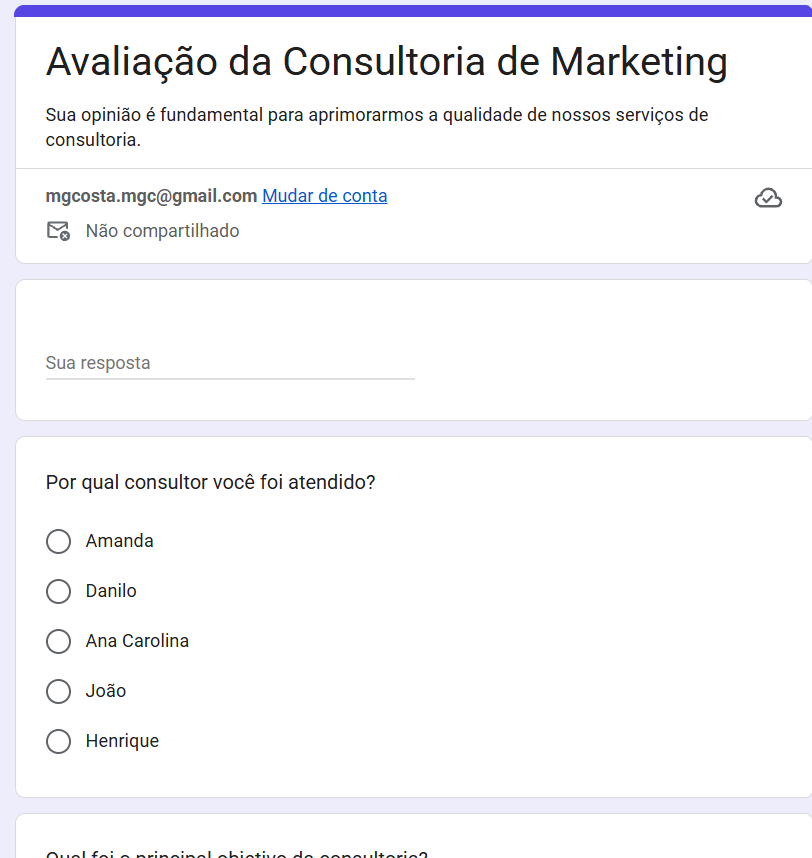
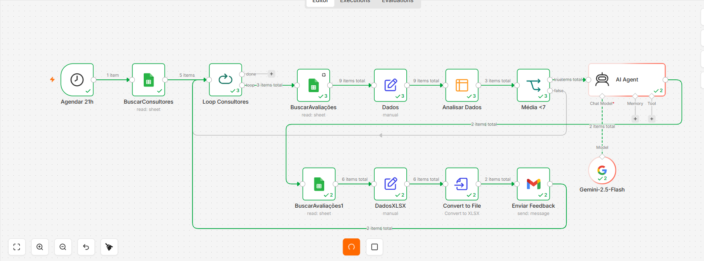
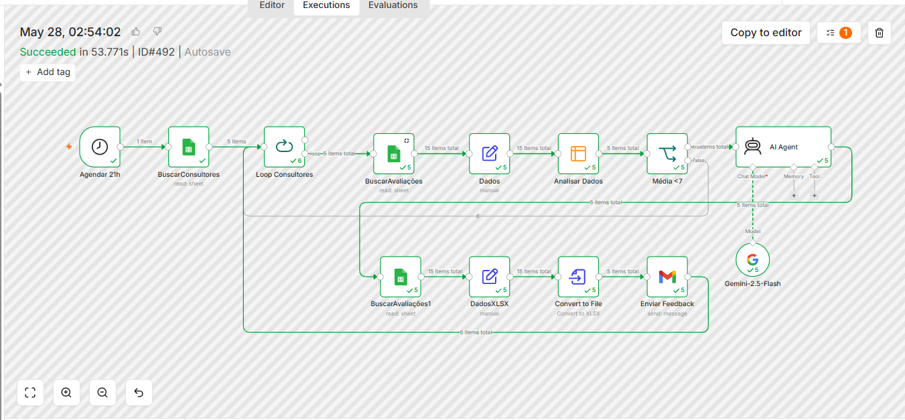
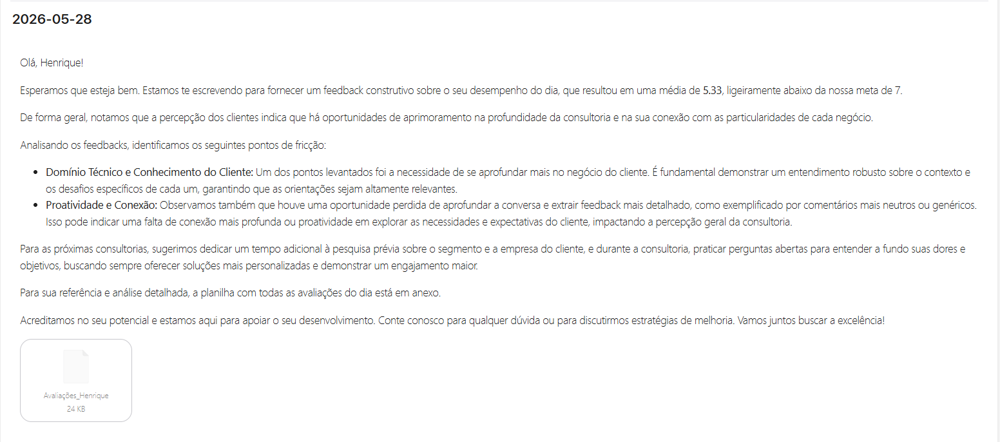
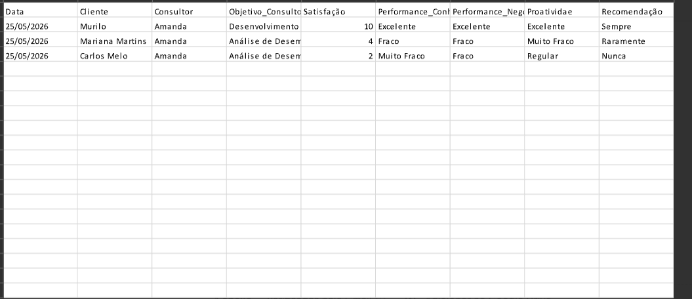

# AI Feedback Analysis System with n8n

Sistema inteligente de análise de feedbacks utilizando IA, n8n, Google Gemini, Gmail e Google Sheets.

---

# Visão Geral

Este projeto automatiza o processo de consolidação, análise e envio de feedbacks personalizados para consultores com base nas avaliações recebidas via formulário.

O sistema realiza:

- Coleta automática das avaliações
- Consolidação de dados por consultor
- Análise inteligente utilizando IA
- Identificação de pontos de melhoria
- Geração automática de relatórios XLSX
- Envio automático de feedback por e-mail

---

# Formulário de Avaliações



---

# Workflow completo no n8n



---

# Execução do fluxo



---

# Feedback automático enviado por e-mail



---

# Relatório XLSX gerado automaticamente



---

# Tecnologias Utilizadas

- n8n
- Google Gemini 2.5 Flash
- Google Sheets
- Gmail
- IA Generativa
- XLSX Report Generation

---

# Fluxo da Automação

1. Agendamento automático da execução
2. Busca da lista de consultores
3. Loop individual por consultor
4. Coleta das avaliações do dia
5. Consolidação dos dados
6. Análise inteligente com IA
7. Geração de insights personalizados
8. Criação automática de relatório XLSX
9. Envio automático do feedback por e-mail

---

# Funcionalidades

## Análise Inteligente
- Interpretação automática dos feedbacks
- Identificação de padrões
- Insights personalizados
- Recomendações de melhoria

## Automação Operacional
- Processamento automático diário
- Consolidação automática de avaliações
- Geração automática de arquivos XLSX

## Comunicação Automatizada
- Envio automático de feedbacks
- E-mails personalizados
- Relatórios anexados automaticamente

## Gestão de Performance
- Média automática das avaliações
- Identificação de consultores abaixo da meta
- Sugestões de melhoria contínua

---

# Estrutura do Projeto

```bash
README.md
/imagens
   formulario-avaliacoes.png
   workflow-feedback.png
   execution-feedback.png
   email-feedback.png
   planilha-feedback.png
```

---

# Melhorias Futuras

- Dashboard analítico
- Histórico de evolução dos consultores
- Score de performance mensal
- Integração com Power BI
- Banco vetorial
- Memória conversacional
- Multiagentes IA

---

# Autor

## Murilo Guimarães Costa

Especialista em Projetos, Automação e IA Aplicada.

- Open Finance
- Gestão de Projetos
- Inteligência Artificial
- n8n Automation
- Power BI

GitHub:
https://github.com/Murilo58
